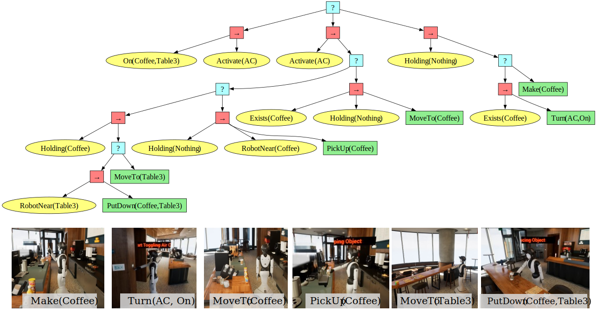

# BTPG: A Platform and Benchmark for Behavior Tree Planning in Everyday Service Robots

A Platform and Benchmark for Behavior Tree Planning in Everyday Service Robots. Based on RoboWaiter and [VirtualHome](http://virtual-home.org/) v2.3.0
<div align="center">

[[Website]](https://dids-ei.github.io/Project/BTPG/)


______________________________________________________________________

</div>
## 🛠️ Installation

### Create a conda environment

```shell
conda create --name BTPG python=3.10
conda activate BTPG
```

### Install BTPGym

```shell
cd BTPG
pip install -e .
```

### 1. Download the VirtualHome executable for your platform (Only Windows is tested now):

| Operating System | Download Link                                                                      |
|:-----------------|:-----------------------------------------------------------------------------------|
| Linux            | [Download](http://virtual-home.org/release/simulator/v2.0/v2.3.0/linux_exec.zip)   |
| MacOS            | [Download](http://virtual-home.org/release/simulator/v2.0/v2.3.0/macos_exec.zip)   |
| Windows          | [Download](http://virtual-home.org/release/simulator/v2.0/v2.3.0/windows_exec.zip) |

### 2. Download the RoboWaiter executable (Only Windows is tested now):

👉 [Download RoboWaiter](https://drive.google.com/file/d/1ayAQZbPOyQV2W-V_ZdYv6AoqLOg0zvm1/view?usp=sharing)

Download the simulator, unzip it, and run `CafeSimulator.exe` to open the simulator. The simulator will display an empty scene, awaiting the code to generate the scene and complete robot interactions.
## 📂 Directory Structure

```
btpg
│
├── agent - Configuration for intelligent agents.
├── algos - Training and decision-making algorithms.
├── bt_planning - Behavior tree planning algorithms.
│   ├── ReactivePlanning 
│   ├── BTExpansion
│   ├── OBTEA
│   └── HOBTEA
├── llm_client - Modules for large language model integration.
│   └── vector_database_env_goal.py - Core vector database functionality.
├── behavior_tree - Behavior tree engine components.
├── envs - Scene environments for agent interaction.
│   ├── base - Foundational elements for environments.
│   ├── gridworld - Grid-based testing environment.
│   ├── RoboWaiter - Café service robot scenario.
│   ├── VirtualHome - Household robot scenario.
│   ├── RobotHow - Testing environment for household robots.
│   └── RobotHow_Small - Smaller version of the household robot testing environment.
└── utils - Supporting functions and utilities.

simulators - Platforms for realistic training environments.

test_exp - Testing modules for behavior trees planning, LLMs, and scene environments.
```

## 🚀 Usage

1. Download the simulator ([windows version](http://virtual-home.org/release/simulator/v2.0/v2.3.0/windows_exec.zip))
2. Unzip all files in windows_exec.v2.2.4 and move them to simulators/virtualhome/windows.
3. Run the test_exp/main.py and see the simulation result.
```python
python test_exp/main.py
```

## 📖 Getting Started
HOBTEA uses OpenAI's GPT-3.5 as the language model. You need to have an OpenAI API key to use HOBTEA. You can get one from [here](https://platform.openai.com/account/api-keys).

After the installation process, you can run BTPG by:

```python
import btpg
import time
from btpg import BehaviorTree
from btpg.utils.tools import *
from btpg.algos.bt_planning.main_interface import BTExpInterface
from btpg.algos.llm_client.tools import goal_transfer_str

# Initialize environment and conditions
scene = "VH"  # RW RH RHS
env, cur_cond_set = setup_environment(scene)
goal_str = 'IsIn_milk_fridge & IsClose_fridge'

# Transfer goal string to goal set
goal_set = goal_transfer_str(goal_str)  # [{'IsIn(milk, fridge)', 'IsClose(fridge)'}]

# Initialize Behavior Tree Planning Interface
algo = BTExpInterface(env.behavior_lib, cur_cond_set=cur_cond_set,
                      priority_act_ls=[], key_predicates=[],
                      key_objects=[],
                      selected_algorithm="hobtea", mode="big",
                      act_tree_verbose=False, time_limit=15,
                      heuristic_choice=0, output_just_best=True)
# Process goal set
algo.process(goal_set)
time_limit_exceeded = algo.algo.time_limit_exceeded
ptml_string, cost, expanded_num = algo.post_process()

# Execute Behavior Tree
error, state, act_num, current_cost, record_act_ls, ticks = algo.execute_bt(
    goal_set[0], cur_cond_set, verbose=False
)

# Output results
print(
    f"\x1b[32m Goal: {goal_str} \n Executed {act_num} action steps\x1b[0m",
    "\x1b[31mERROR\x1b[0m" if error else "",
    "\x1b[31mTIMEOUT\x1b[0m" if time_limit_exceeded else ""
)
print("Current cost:", current_cost, "Expanded nodes:", expanded_num)

# Save Behavior Tree to file
file_name = "tree"
file_path = f'./{file_name}.btml'
with open(file_path, 'w') as file:
    file.write(ptml_string)

# Load and visualize Behavior Tree
bt = BehaviorTree(file_path, env.behavior_lib)
bt.print()
bt.draw()

# Simulate execution in a simulated scenario
goal = goal_set[0]
print(f"Goal: {goal}")
env.agents[0].bind_bt(bt)
env.reset()

is_finished = False
while not is_finished:
    is_finished = env.step()
    if goal <= env.agents[0].condition_set:
        is_finished = True

env.close()
```


## 🎮 Simulation
The images below illustrate examples from two simulation scenarios, including behavior trees generated by LLM-HOBTEA and their corresponding simulation environments.

### RoboWaiter
The RoboWaiter scenario involves a service robot performing tasks in a café setting. 

**Goal:** `On(Coffee,Table3) & Active(AC)`


### VirtualHome
The VirtualHome scenario simulates a household environment where a robot performs various domestic tasks.

**Goal:** `IsIn(bananas,fridge) & IsClose(fridge)`


## 📜 License

This project is licensed under the MIT License. See the [LICENSE](LICENSE) file for details.

